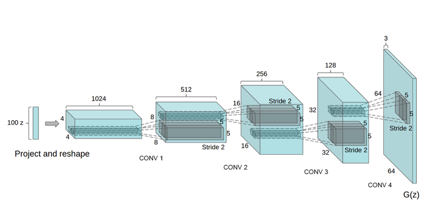

# Faces-DCGAN-SAGAN

The aim of this project is to learn and implement generative models based on
differentiable generator networks, mainly Deep Convolutional GAN (DCGAN)
and Self-Attention GAN (SA-GAN). Project requirements include: 
<ul>
<li>Implementation of Deep Convolutional GAN and Self-Attention GAN consisting of a Generator (G) and Discriminator (D) using the CIFAR10 dataset.
<li>Applying Spectral Normalization (SN) on G and D.

<li>Implementation of self-attention (SA) GAN module

<li>Implementation of Wasserstein Loss function for the training

<li>Applying Frechet Inception Distance (FID) as an evaluation metric and validating the training epochs using FID with a validation set.

<li>Computing the FID score during training at every 500 iterations and visualising the attention layers

</ul>

##  Deep Convolutional GAN
Architecture guidelines for stable Deep Convolutional GANs:

<ul>
<li> Replace any pooling layers with strided convolutions (discriminator) and fractional-strided convolutions (generator).

<li>Use batchnorm in both the generator and the discriminator

<li>Remove fully connected hidden layers for deeper architectures.

<li>Implementation of Wasserstein Loss function for the training

<li>Use ReLU activation in generator for all layers except for the output, which uses Tanh

<li>Use LeakyReLU activation in the discriminator for all layers.

</ul>

### Results

 

## Self Attention GAN

Self-Attention Generative Adversarial Network (SAGAN) allows attention-driven, long-range dependency modeling for image generation tasks. Traditional convolutional GANs generate high-resolution
details as a function of only spatially local points in lower-resolution feature maps. In SAGAN, details
can be generated using cues from all feature locations. Moreover, the discriminator can check that
highly detailed features in distant portions of the image are consistent with each other. Furthermore,
recent work has shown that generator conditioning affects GAN performance. Therefore, we apply
spectral normalization to the GAN generator and find that this improves training dynamics.
Though DCGANs have significantly improved the training stability of GANs, using convolutional
layers alone is computationally inefficient for long-range modeling dependencies in images. Adding
self-attention to the GANs enables the generator and the discriminator to efficiently model relationships between widely separated spatial regions.  

### Results

